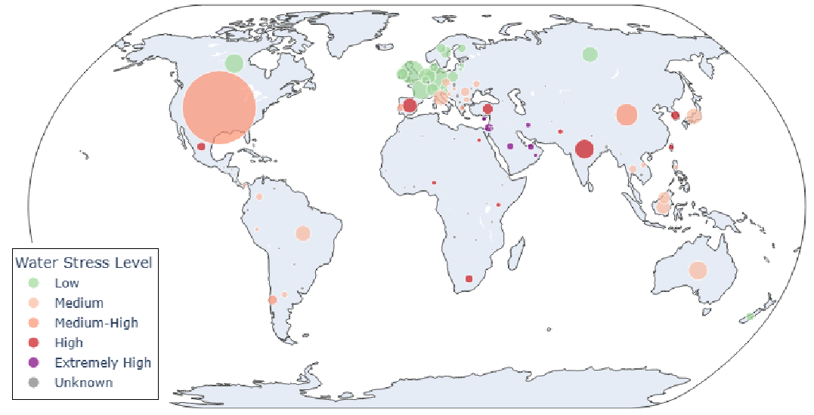

# WaterforAI

This repository supports the research article:  
**"Sustainable AI infrastructure: A scenario-based forecast of water footprint under uncertainty"**  
by Manuel Herrera, Xiang Xie, Andrea Menapace, Ariele Zanfei, Bruno M. Brentan (2025); submitted to the Journal of Cleaner Production.

## 📌 Overview

As AI workloads grow globally, so does the environmental footprint of the data centres that support them, particularly water consumption. This repository provides the code, data, and visualisations used in our Bayesian scenario-based forecasts of water demand from AI data centres under different global growth and efficiency pathways.

## 📁 Repository Structure
<pre>
📂 data/  
    └── DataCenters_WaterStress.csv           # Data centre locations with water stress levels   

📂 code/  
    └── Water4AI_main_analysis.ipynb          # Main Monte Carlo script  
    └── Water4AI_sensitivity_plot.ipynb       # Supporting functions  
    └── Worldmap_AI_water.ipynb               # Worldmap visualisation

📂 visualisations/  
    └── global_map_ai_water.html              # Interactive HTML map of data centre water risk
</pre>
## 🧮 Bayesian Forecasting Model

The model estimates operational and embodied water demand from AI data centres globally, using a Monte Carlo simulation with 10,000 iterations. It is scenario-based (BAU, Moderate, Sustainable) and includes sensitivity analysis to WUE, PUE, EWIF, and EWU.

## 🌍 Interactive Map

The HTML map visualises the global distribution of data centres overlaid with regional water stress levels (WWF baseline water risk), allowing users to explore where infrastructure overlaps with hydrological risk.

## 🔧 Requirements

- Python 3.7 or higher (tested with 3.9)
- `pandas`, `numpy`, `matplotlib`, `plotly`, `scipy`

## ✉️ Contact

For questions or collaboration inquiries, contact:  
**Manuel Herrera** – manuel.herrera@newcastle.ac.uk
